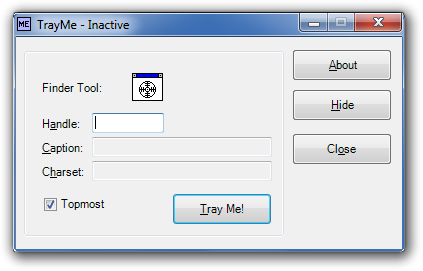
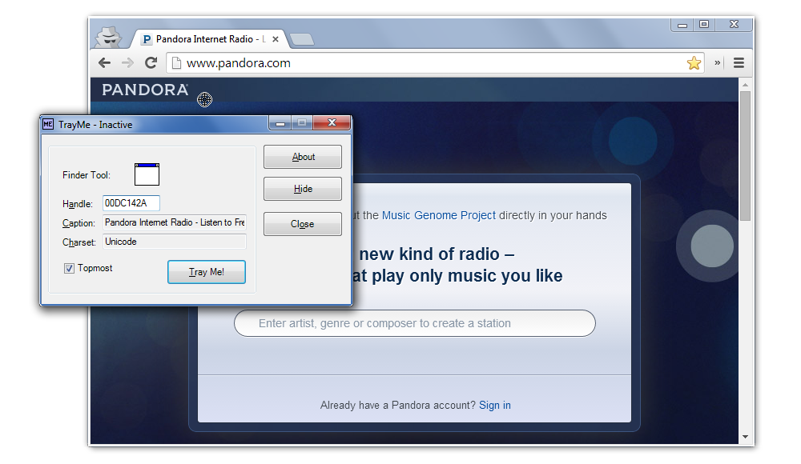

TrayMe
======



TrayMe is a small application that allows you send a window to the notification area.


Why
---

Some long-running applications don't have the option to send to the notification area, but
have no other reason to be left open. Examples include some email and chat applications,
or even long-running browser windows that take up valuable tab space.


How to use it
-------------

Simply drag the target onto a window and press "Tray Me!"



You can now click the "X" on the targeted application and it will be sent to
the tray area instead of exiting.


How it works
------------

TrayMe uses what's called [DLL injection](http://en.wikipedia.org/wiki/DLL_injection) to
hook into the process of the window and override the behavior of clicking its "X" button.

Once hooked, the TrayMe application can freely exit, and the targeted application
will continue to be trayable. Right-clicking the tray icon will provide a menu that
lets you "untray" the application so it can be exited normally. However the process exits,
TrayMe will clean itself up. When you run the application, you'll have to run TrayMe again.

Read the next section for options on how to automatically tray an application each time it's run.


Command-line interface
----------------------

Using the CLI, you can create Windows Shortcuts (right-click the desktop, select "New",
"Shortcut") to automatically run an application that can be sent to the tray.

#### Usage

```bat
> TrayMe [options] [target [cmd]]
```

##### Options

```
-h          -  Displays this help message
-s          -  Show window; do not close to tray
-t=<title>  -  Tray title instead of main window
-q          -  Quiet mode; display no command line errors
-x          -  Do not exit when trayed by command line
```

##### Arguments

```
target      -  The target executable to tray
cmd         -  The command line to be passed to the target
```


Limitations
-----------

Currently there's a 1-to-1 correspondence on the number of applications you
can tray per DLL. The workaround is to create a copy of the TrayMe binaries for
each application you wish to send to the tray area. There's no current plans to
fix this, but if there's any interest, feel free to express it in an issue or
submit your own pull request.


Contributing
------------

1. Check the open issues or open a new issue to start a discussion around
   your feature idea or the bug you found
2. Fork the repository, make your changes, and push to your fork
3. Send a pull request

Like this software? Please consider supporting me on
<a href="http://gittip.com/joeyespo" title="Thank you!">
  
</a>
